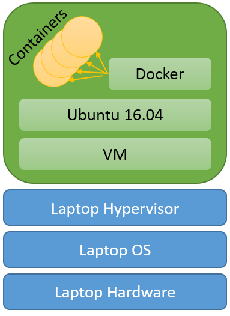
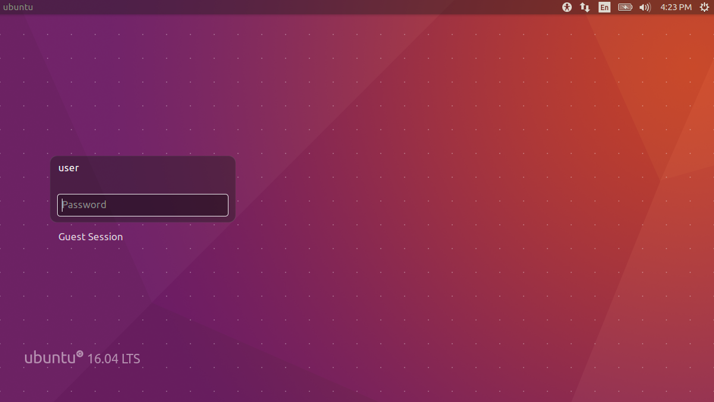
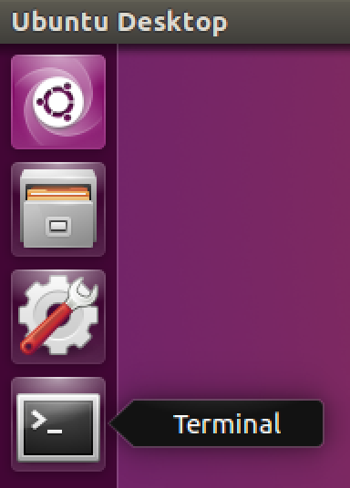

# Docker Containers

Docker is an open-source software system that automates the deployment of application processes inside software
containers. Containers abstract an application's operating environment from the underlying operating system. Containers
also support the resource isolation features of the Linux kernel, such as cgroups and kernel namespaces, allowing many
diverse containers to run within a single Linux instance without resource contention. Containers eliminate the overhead
and startup latency of a full virtual machine while preserving most of the isolation benefits.

Docker can package an application and its dependencies into an image, which can be used to launch a container on any
Linux system. This enables flexibility and portability, allowing applications to run reliably across a number of Linux
distributions with various configurations in a range of cloud settings.



The Docker system comes in a Community Edition (CE) and an Enterprise Edition (EE).

Docker EE edition includes support and other features such as container management (Docker Datacenter) and Docker
Security Scanning. Docker EE is supported by Alibaba, Canonical, HPE, IBM, Microsoft, RedHat and by a network of
regional partners. Those who want to test Docker EE can download a trial version for free from the official site.

The Docker Community Edition is the same docker code but with only community support available for free of cost. The
community edition is available in two versions:

- Edge - released each month with the latest features but now as well tested
- Stable - released on a quarterly and well tested

 Edge receives security updates and bug fixes for the current release only, however the stable version gets similar
 updates for four months after release.

The core Docker components of CE and EE are essentially identical at source code level and based on the same open source
Docker project, developed in the open with Docker’s community of partners and contributors.


## Lab 1 – Installing Docker

In this lab we will install and test Docker CE Stable on the classroom supplied virtual lab machine [see model above].
The lab VM is an Ubuntu server with a basic desktop installed. Versions of the lab system are available for Virtual Box
and VMware desktop hypervisors. If you do not have a copy of the lab VM, instructions for downloading it can be found
here:

- https://github.com/RX-M/classfiles/blob/master/lab-setup.md

The Lab system user account is "user" and the password is "user". This user has full sudo permissions.


### 1. Explore Ubuntu built-in Docker support

Start your classroom virtual machine and log in as “user” with the password “user”.



There is no reason to update this lab system and doing so may require large downloads. If the VM prompts you to perform
a system update, choose the “Remind me later” option to avoid tying up the class room Internet connection.

The Launch Pad on the left side of the desktop has short cuts to commonly used programs. Click the Terminal icon to
launch a new Bash command line shell.



In the terminal window use the `apt-cache` command to display the Docker packages available:

```
user@ubuntu:~$ apt-cache search docker

libcib-dev - cluster resource manager CIB library development
libcib4 - cluster resource manager CIB library
libcrmcluster-dev - cluster resource manager cluster library development
libcrmcluster4 - cluster resource manager cluster library
libcrmcommon-dev - cluster resource manager common library development
libcrmcommon3 - cluster resource manager common library
libcrmservice-dev - cluster resource manager service library development
libcrmservice3 - cluster resource manager service library
liblrmd-dev - cluster resource manager LRMD library development
liblrmd1 - cluster resource manager LRMD library
libpe-rules2 - cluster resource manager Policy Engine rules library
libpe-status10 - cluster resource manager Policy Engine status library
libpengine-dev - cluster resource manager Policy Engine library development
libpengine10 - cluster resource manager Policy Engine library
libstonithd-dev - cluster resource manager STONITH daemon library development
libstonithd2 - cluster resource manager STONITH daemon library
libtransitioner2 - cluster resource manager transitioner library
pacemaker - cluster resource manager
pacemaker-cli-utils - cluster resource manager command line utilities
pacemaker-common - cluster resource manager common files
pacemaker-doc - cluster resource manager HTML documentation
pacemaker-resource-agents - cluster resource manager general resource agents
python-magnumclient - client library for Magnum API - Python 2.x
python-magnumclient-doc - client library for Magnum API - doc
cadvisor - analyze resource usage and performance characteristics of running containers
ctop - Command line / text based Linux Containers monitoring tool
debocker - docker-powered package builder for Debian
debootstick - Turn a chroot environment into a bootable image
docker - System tray for KDE3/GNOME2 docklet applications
docker-compose - Punctual, lightweight development environments using Docker
docker-registry - Docker toolset to pack, ship, store, and deliver content
docker.io - Linux container runtime
golang-docker-dev - Transitional package for golang-github-docker-docker-dev
golang-github-docker-distribution-dev - Docker toolset to pack, ship, store, and deliver content (source)
golang-github-docker-docker-dev - Externally reusable Go packages included with Docker
golang-github-docker-go-units-dev - parse and print size and time units in human-readable format
golang-github-docker-libkv-dev - Key/Value store abstraction library
golang-github-docker-libtrust-dev - Primitives for identity and authorization
golang-github-docker-notary-dev - tool for running and interacting with trusted collections
golang-github-docker-spdystream-dev - multiplexed stream library using spdy
golang-github-endophage-gotuf-dev - Go implementation of the TUF specification
golang-github-fsouza-go-dockerclient-dev - Docker client library in Go
golang-github-google-cadvisor-dev - analyze resource usage and performance of running containers
golang-github-opencontainers-runc-dev - Open Container Project - develpoment files
golang-github-samalba-dockerclient-dev - Docker client library in Go
golang-github-vishvananda-netlink-dev - netlink library for go
gosu - Simple Go-based setuid+setgid+setgroups+exec
karbon - vector graphics application for the Calligra Suite
kdocker - lets you dock any application into the system tray
libnss-docker - nss module for finding Docker containers
magnum-api - OpenStack containers as a service
magnum-common - OpenStack containers as a service - API server
magnum-conductor - OpenStack containers as a service - conductor
needrestart - check which daemons need to be restarted after library upgrades
ovn-docker - OVN Docker drivers
pacemaker-remote - cluster resource manager proxy daemon for remote nodes
pidgin - graphical multi-protocol instant messaging client for X
python-dockerpty - Pseudo-tty handler for docker Python client (Python 2.x)
python-magnum - OpenStack containers as a service - Python library
python3-dockerpty - Pseudo-tty handler for docker Python client (Python 3.x)
python3-magnumclient - client library for Magnum API - Python 3.x
rawdns - raw DNS interface to the Docker API
ruby-docker-api - Ruby gem to interact with docker.io remote API
sen - Terminal user interface for docker engine
systemd-docker - wrapper for "docker run" to handle systemd quirks
vim-syntax-docker - Docker container engine - Vim highlighting syntax files
docker-doc - Linux container runtime -- documentation
golang-github-docker-containerd-dev - runC develpoment files
python-docker - Python wrapper to access docker.io's control socket
python3-docker - Python 3 wrapper to access docker.io's control socket
cockpit-docker - Cockpit user interface for Docker containers

user@ubuntu:~$
```

Several of the items listed are associated with the Docker container management system. Among others, the docker.io
package provides the Docker container runtime and client executable, docker-compose installs the docker tool used to
launch multiple containers at once and the vim-syntax-docker package allows the Vim editor to perform syntax
highlighting on Dockerfiles. To find out what version of Docker the docker.io package offers, use the `apt-cache policy`
subcommand:

```
user@ubuntu:~$ apt-cache policy docker.io

docker.io:
  Installed: (none)
  Candidate: 1.12.6-0ubuntu1~16.04.1
  Version table:
     1.12.6-0ubuntu1~16.04.1 500
        500 http://us.archive.ubuntu.com/ubuntu xenial-updates/universe amd64 Packages
     1.10.3-0ubuntu6 500
        500 http://us.archive.ubuntu.com/ubuntu xenial/universe amd64 Packages

user@ubuntu:~$        
```

Note the version of the docker.io package. Docker is a very fast moving platform. Near the release of Ubuntu 16.04
Docker version 1.10 was current, however a few months later several significant Docker releases had been made available.
If we want the latest version of Docker, installing from default packages is not the right approach. Fortunately it is
easy to install the latest Docker on most Linux systems directly from get.docker.com packages.


### 2. Install Docker from packages

As discussed in class, Docker supplies installation instructions for many platforms. The Ubuntu 16.04 installation guide
can be found online here (__do not__ follow these instructions, however, if you have time, you may want to scan the
content):

- https://docs.docker.com/engine/installation/linux/ubuntu/

As described in the installation guide, Docker requires a 64 bit system with a Linux kernel having version 3.10 or
newer. Use the `uname` command to check the version of your kernel:

```
user@ubuntu:~$ uname -r

4.4.0-31-generic

user@ubuntu:~$
```

Before we install Docker we need to install some packages to allow apt to use a repository over HTTPS. As a preliminary
step update the package manager indexes on the host:

> If your receive the error: "E: Unable to lock the administration directory (/var/lib/dpkg/), is another process using
it?", your system is probably performing apt initialization in the background. If you wait a minute or two for all of
the processes running /usr/bin/dpkg to exit, you should then be able to perform the installation.

```
user@ubuntu:~$ sudo apt-get update

Hit:1 http://us.archive.ubuntu.com/ubuntu xenial InRelease
Get:2 http://security.ubuntu.com/ubuntu xenial-security InRelease [102 kB]
Get:3 http://us.archive.ubuntu.com/ubuntu xenial-updates InRelease [102 kB]
Get:4 http://us.archive.ubuntu.com/ubuntu xenial-backports InRelease [102 kB]     
Fetched 306 kB in 1s (294 kB/s)                                   
Reading package lists... Done

user@ubuntu:~$
```

With the package indexes updated, we can now install apt support for HTTPS package distribution:

```
user@ubuntu:~$ sudo apt-get install apt-transport-https ca-certificates curl software-properties-common

Reading package lists... Done
Building dependency tree       
Reading state information... Done
ca-certificates is already the newest version (20160104ubuntu1).
The following additional packages will be installed:
  libcairo-perl libcurl3-gnutls libglib-perl libgtk2-perl libpango-perl
  python3-software-properties software-properties-gtk
Suggested packages:
  libfont-freetype-perl libgtk2-perl-doc
The following NEW packages will be installed:
  libcairo-perl libglib-perl libgtk2-perl libpango-perl
The following packages will be upgraded:
  apt-transport-https curl libcurl3-gnutls python3-software-properties
  software-properties-common software-properties-gtk
6 upgraded, 4 newly installed, 0 to remove and 299 not upgraded.
Need to get 1,206 kB/1,528 kB of archives.
After this operation, 4,814 kB of additional disk space will be used.
Do you want to continue? [Y/n] y
Get:1 http://us.archive.ubuntu.com/ubuntu xenial-updates/main amd64 apt-transport-https amd64 1.2.20 [26.1 kB]
Get:2 http://us.archive.ubuntu.com/ubuntu xenial/universe amd64 libcairo-perl amd64 1.106-1build1 [88.2 kB]
Get:3 http://us.archive.ubuntu.com/ubuntu xenial/universe amd64 libglib-perl amd64 3:1.320-2 [326 kB]
Get:4 http://us.archive.ubuntu.com/ubuntu xenial/universe amd64 libpango-perl amd64 1.227-1 [154 kB]
Get:5 http://us.archive.ubuntu.com/ubuntu xenial/universe amd64 libgtk2-perl amd64 2:1.2498-1 [534 kB]
Get:6 http://us.archive.ubuntu.com/ubuntu xenial-updates/main amd64 software-properties-common all 0.96.20.7 [9,452 B]
Get:7 http://us.archive.ubuntu.com/ubuntu xenial-updates/main amd64 software-properties-gtk all 0.96.20.7 [47.2 kB]
Get:8 http://us.archive.ubuntu.com/ubuntu xenial-updates/main amd64 python3-software-properties all 0.96.20.7 [20.3 kB]
Fetched 1,206 kB in 5s (240 kB/s)                 
(Reading database ... 92876 files and directories currently installed.)
Preparing to unpack .../curl_7.47.0-1ubuntu2.2_amd64.deb ...
Unpacking curl (7.47.0-1ubuntu2.2) over (7.47.0-1ubuntu2) ...
Preparing to unpack .../libcurl3-gnutls_7.47.0-1ubuntu2.2_amd64.deb ...
Unpacking libcurl3-gnutls:amd64 (7.47.0-1ubuntu2.2) over (7.47.0-1ubuntu2) ...
Preparing to unpack .../apt-transport-https_1.2.20_amd64.deb ...
Unpacking apt-transport-https (1.2.20) over (1.2.12~ubuntu16.04.1) ...
Selecting previously unselected package libcairo-perl.
Preparing to unpack .../libcairo-perl_1.106-1build1_amd64.deb ...
Unpacking libcairo-perl (1.106-1build1) ...
Selecting previously unselected package libglib-perl.
Preparing to unpack .../libglib-perl_3%3a1.320-2_amd64.deb ...
Unpacking libglib-perl (3:1.320-2) ...
Selecting previously unselected package libpango-perl.
Preparing to unpack .../libpango-perl_1.227-1_amd64.deb ...
Unpacking libpango-perl (1.227-1) ...
Selecting previously unselected package libgtk2-perl.
Preparing to unpack .../libgtk2-perl_2%3a1.2498-1_amd64.deb ...
Unpacking libgtk2-perl (2:1.2498-1) ...
Preparing to unpack .../software-properties-common_0.96.20.7_all.deb ...
Unpacking software-properties-common (0.96.20.7) over (0.96.20.2) ...
Preparing to unpack .../software-properties-gtk_0.96.20.7_all.deb ...
Unpacking software-properties-gtk (0.96.20.7) over (0.96.20.2) ...
Preparing to unpack .../python3-software-properties_0.96.20.7_all.deb ...
Unpacking python3-software-properties (0.96.20.7) over (0.96.20.2) ...
Processing triggers for man-db (2.7.5-1) ...
Processing triggers for libc-bin (2.23-0ubuntu3) ...
Processing triggers for dbus (1.10.6-1ubuntu3) ...
Processing triggers for shared-mime-info (1.5-2ubuntu0.1) ...
Processing triggers for gnome-menus (3.13.3-6ubuntu3.1) ...
Processing triggers for desktop-file-utils (0.22-1ubuntu5) ...
Processing triggers for bamfdaemon (0.5.3~bzr0+16.04.20160701-0ubuntu1) ...
Rebuilding /usr/share/applications/bamf-2.index...
Processing triggers for mime-support (3.59ubuntu1) ...
Processing triggers for hicolor-icon-theme (0.15-0ubuntu1) ...
Setting up libcurl3-gnutls:amd64 (7.47.0-1ubuntu2.2) ...
Setting up curl (7.47.0-1ubuntu2.2) ...
Setting up apt-transport-https (1.2.20) ...
Setting up libcairo-perl (1.106-1build1) ...
Setting up libglib-perl (3:1.320-2) ...
Setting up libpango-perl (1.227-1) ...
Setting up libgtk2-perl (2:1.2498-1) ...
Setting up python3-software-properties (0.96.20.7) ...
Setting up software-properties-common (0.96.20.7) ...
Setting up software-properties-gtk (0.96.20.7) ...
Processing triggers for libc-bin (2.23-0ubuntu3) ...

user@ubuntu:~$
```

Docker Inc. has a GPG key that we can use to automatically verify package contents. Add Docker’s official GPG key and
verify that the fingerprint is the expected value: `9DC8 5822 9FC7 DD38 854A E2D8 8D81 803C 0EBF CD88`

```
user@ubuntu:~$ curl -fsSL https://download.docker.com/linux/ubuntu/gpg | sudo apt-key add -

OK

user@ubuntu:~$ sudo apt-key fingerprint 0EBFCD88

pub   4096R/0EBFCD88 2017-02-22
      Key fingerprint = 9DC8 5822 9FC7 DD38 854A  E2D8 8D81 803C 0EBF CD88
uid                  Docker Release (CE deb) <docker@docker.com>
sub   4096R/F273FCD8 2017-02-22

user@ubuntu:~$
```

Now we can add the repository that hosts the stable Docker release packages (you always need the stable repository, even
if you want to install edge builds) and update the apt indexes.

> Note: The lsb_release -cs sub-command below returns the name of your Ubuntu distribution, such as xenial

```
user@ubuntu:~$ sudo add-apt-repository \
"deb [arch=amd64] https://download.docker.com/linux/ubuntu $(lsb_release -cs) stable"

user@ubuntu:~$
```

Update the package indexes to add the Docker packages from download.docker.com & install the latest version of Docker CE
on Ubuntu, which will configure and launch the Docker Engine:

```
user@ubuntu:~$ sudo apt-get update

Get:1 http://security.ubuntu.com/ubuntu xenial-security InRelease [102 kB]
Hit:2 http://us.archive.ubuntu.com/ubuntu xenial InRelease
Get:3 http://us.archive.ubuntu.com/ubuntu xenial-updates InRelease [102 kB]
Get:4 http://us.archive.ubuntu.com/ubuntu xenial-backports InRelease [102 kB]
Get:5 https://download.docker.com/linux/ubuntu xenial InRelease [20.1 kB]
Get:6 https://download.docker.com/linux/ubuntu xenial/stable amd64 Packages [1,479 B]
Fetched 328 kB in 3s (86.2 kB/s)
Reading package lists... Done

user@ubuntu:~$
```

You might ask, didn't we just do this? Yes, but this time around, the repo for Docker was included. Now Install the
latest version of Docker CE, which will configure and launch the Docker Engine:

```
user@ubuntu:~$ sudo apt-get -y install docker-ce

Reading package lists... Done
Building dependency tree       
Reading state information... Done
The following additional packages will be installed:
  aufs-tools cgroupfs-mount
The following NEW packages will be installed:
  aufs-tools cgroupfs-mount docker-ce
0 upgraded, 3 newly installed, 0 to remove and 360 not upgraded.
Need to get 21.1 MB of archives.
After this operation, 99.9 MB of additional disk space will be used.
Get:1 https://download.docker.com/linux/ubuntu xenial/stable amd64 docker-ce amd64 17.09.0~ce-0~ubuntu [21.0 MB]
Get:2 http://us.archive.ubuntu.com/ubuntu xenial/universe amd64 aufs-tools amd64 1:3.2+20130722-1.1ubuntu1 [92.9 kB]
Get:3 http://us.archive.ubuntu.com/ubuntu xenial/universe amd64 cgroupfs-mount all 1.2 [4,970 B]
Fetched 21.1 MB in 1s (13.2 MB/s)                           
Selecting previously unselected package aufs-tools.
(Reading database ... 93131 files and directories currently installed.)
Preparing to unpack .../aufs-tools_1%3a3.2+20130722-1.1ubuntu1_amd64.deb ...
Unpacking aufs-tools (1:3.2+20130722-1.1ubuntu1) ...
Selecting previously unselected package cgroupfs-mount.
Preparing to unpack .../cgroupfs-mount_1.2_all.deb ...
Unpacking cgroupfs-mount (1.2) ...
Selecting previously unselected package docker-ce.
Preparing to unpack .../docker-ce_17.09.0~ce-0~ubuntu_amd64.deb ...
Unpacking docker-ce (17.09.0~ce-0~ubuntu) ...
Processing triggers for libc-bin (2.23-0ubuntu3) ...
Processing triggers for man-db (2.7.5-1) ...
Processing triggers for ureadahead (0.100.0-19) ...
Processing triggers for systemd (229-4ubuntu7) ...
Setting up aufs-tools (1:3.2+20130722-1.1ubuntu1) ...
Setting up cgroupfs-mount (1.2) ...
Setting up docker-ce (17.09.0~ce-0~ubuntu) ...
Processing triggers for libc-bin (2.23-0ubuntu3) ...
Processing triggers for systemd (229-4ubuntu7) ...
Processing triggers for ureadahead (0.100.0-19) ...

user@ubuntu:~$
```

Normal user accounts must use the `sudo` command to run command line tools as *root*. For our in-class purposes,
eliminating the need for `sudo` execution of the Docker command will simplify our practice sessions. To make it possible
to connect to the local Docker daemon domain socket without `sudo` we need to add our *user* id to the *docker* group.
To add the *user* account to the *docker* group execute the following command:

```
user@ubuntu:~$ sudo usermod -aG docker user

user@ubuntu:~$
```

Now display the ID and Group IDs for *user*:

```
user@ubuntu:~$ id user

uid=1000(user) gid=1000(user) groups=1000(user),4(adm),24(cdrom),27(sudo),30(dip),46(plugdev),110(lxd),115(lpadmin),116(sambashare),999(docker)

user@ubuntu:~$
```

The account *user* is now a member of the *docker* group. Try running `id` without an account name:

```
user@ubuntu:~$ id

uid=1000(user) gid=1000(user) groups=1000(user),4(adm),24(cdrom),27(sudo),30(dip),46(plugdev),110(lxd),115(lpadmin),116(sambashare)

user@ubuntu:~$
```

The docker group is missing! While the *docker* group was added to your group list, your login shell maintains the old
groups. After updating your user groups you will need to restart your login shell to ensure the changes take effect.
Reboot your system to complete the installation.

```
user@ubuntu:~$ sudo reboot
```

While a reboot is not completely necessary it verifies that your system is properly configured to boot up with the
Docker daemon running.

When the system has restarted log back in as *user* with the password *user*.


### 3. Verify the installation

Check your Docker client version with the Docker client `--version` switch:

```
user@ubuntu:~$ docker --version

Docker version 17.09.0-ce, build afdb6d4

user@ubuntu:~$
```

Verify that the Docker server (also known as Docker daemon/Engine) is running using the system service interface. We are
using Ubuntu 16.04 with the systemd service manager, so we need to use the `systemctl status` subcommand:

```
user@ubuntu:~$ systemctl status docker

● docker.service - Docker Application Container Engine
   Loaded: loaded (/lib/systemd/system/docker.service; enabled; vendor preset: enabled)
   Active: active (running) since Sun 2017-11-05 22:45:28 PST; 9min ago
     Docs: https://docs.docker.com
 Main PID: 1296 (dockerd)
    Tasks: 20
   Memory: 65.6M
      CPU: 3.338s
   CGroup: /system.slice/docker.service
           ├─1296 /usr/bin/dockerd -H fd://
           └─1402 docker-containerd -l unix:///var/run/docker/libcontainerd/docker-containerd.sock --metrics-interval=0 --start-timeout 2m --st

Nov 05 22:45:26 ubuntu dockerd[1296]: time="2017-11-05T22:45:26.647226603-08:00" level=warning msg="Your kernel does not support swap memory li
Nov 05 22:45:26 ubuntu dockerd[1296]: time="2017-11-05T22:45:26.647518097-08:00" level=warning msg="Your kernel does not support cgroup rt peri
Nov 05 22:45:26 ubuntu dockerd[1296]: time="2017-11-05T22:45:26.647555563-08:00" level=warning msg="Your kernel does not support cgroup rt runt
Nov 05 22:45:26 ubuntu dockerd[1296]: time="2017-11-05T22:45:26.648935474-08:00" level=info msg="Loading containers: start."
Nov 05 22:45:27 ubuntu dockerd[1296]: time="2017-11-05T22:45:27.924180666-08:00" level=info msg="Default bridge (docker0) is assigned with an I
Nov 05 22:45:27 ubuntu dockerd[1296]: time="2017-11-05T22:45:27.960666810-08:00" level=info msg="Loading containers: done."
Nov 05 22:45:28 ubuntu dockerd[1296]: time="2017-11-05T22:45:28.493304325-08:00" level=info msg="Docker daemon" commit=afdb6d4 graphdriver(s)=o
Nov 05 22:45:28 ubuntu dockerd[1296]: time="2017-11-05T22:45:28.517125227-08:00" level=info msg="Daemon has completed initialization"
Nov 05 22:45:28 ubuntu dockerd[1296]: time="2017-11-05T22:45:28.574851005-08:00" level=info msg="API listen on /var/run/docker.sock"
Nov 05 22:45:28 ubuntu systemd[1]: Started Docker Application Container Engine.
lines 1-22/22 (END)

user@ubuntu:~$
```

- What is the path of the service configuration file loaded by systemd?
- Where could we find more documentation?
- What is the process ID of the Docker daemon?
- What is the name of the Docker daemon executable?
- Under the CGroup key for the docker.service two processes are listed, what are their names and IDs?
- Does your kernel support limiting swap memory?
- What Unix domain socket is the containerd daemon listening on?
- Did Docker start successfully?

Type **q** to quit the output view.

By default, the Docker daemon listens on a Unix socket for commands. This Unix socket is only accessible locally by
*root* and the *docker* group by default. On our lab system, the Docker command line client will communicate with the
Docker daemon using this domain socket, requiring the user to be *root* or to be a member of the *docker* group.

Display the contents of the systemd docker service configuration file (the config file found in the output of the
systemd status command above):

```
user@ubuntu:~$ cat /lib/systemd/system/docker.service

[Unit]
Description=Docker Application Container Engine
Documentation=https://docs.docker.com
After=network-online.target docker.socket firewalld.service
Wants=network-online.target
Requires=docker.socket

[Service]
Type=notify
# the default is not to use systemd for cgroups because the delegate issues still
# exists and systemd currently does not support the cgroup feature set required
# for containers run by docker
ExecStart=/usr/bin/dockerd -H fd://
ExecReload=/bin/kill -s HUP $MAINPID
LimitNOFILE=1048576
# Having non-zero Limit*s causes performance problems due to accounting overhead
# in the kernel. We recommend using cgroups to do container-local accounting.
LimitNPROC=infinity
LimitCORE=infinity
# Uncomment TasksMax if your systemd version supports it.
# Only systemd 226 and above support this version.
TasksMax=infinity
TimeoutStartSec=0
# set delegate yes so that systemd does not reset the cgroups of docker containers
Delegate=yes
# kill only the docker process, not all processes in the cgroup
KillMode=process
# restart the docker process if it exits prematurely
Restart=on-failure
StartLimitBurst=3
StartLimitInterval=60s

[Install]
WantedBy=multi-user.target

user@ubuntu:~$
```

As you can see the docker daemon "Requires=docker.socket".

Use systemctl to display the status of the docker.socket:

```
user@ubuntu:~$ systemctl status docker.socket

● docker.socket - Docker Socket for the API
   Loaded: loaded (/lib/systemd/system/docker.socket; enabled; vendor preset: enabled)
   Active: active (running) since Sun 2017-11-05 22:45:16 PST; 4h 33min ago
   Listen: /var/run/docker.sock (Stream)

Nov 05 22:45:16 ubuntu systemd[1]: Starting Docker Socket for the API.
Nov 05 22:45:16 ubuntu systemd[1]: Listening on Docker Socket for the API.

user@ubuntu:~$
```

Examine the permissions on the `/var/run/docker.sock` socket file and the groups associated with your login ID.

```
user@ubuntu:~$ ls -l /var/run/docker.sock

srw-rw---- 1 root docker 0 Jul 14 16:44 /var/run/docker.sock

user@ubuntu:~$
```

Now examine your group membership:

```
user@ubuntu:~$ id

uid=1000(user) gid=1000(user) groups=1000(user),4(adm),24(cdrom),27(sudo),30(dip),46(plugdev),110(lxd),115(lpadmin),116(sambashare),999(docker)

user@ubuntu:~$
```

The reason we can issue commands through /var/run/docker.sock to the docker daemon is that "user" is a member of the
docker group and the docker group is the group owner of the Docker socket with RW permission.

Check the version of all parts of the Docker platform with the `docker version` subcommand:

```
user@ubuntu:~$ docker version

Client:
 Version:      17.09.0-ce
 API version:  1.32
 Go version:   go1.8.3
 Git commit:   afdb6d4
 Built:        Tue Sep 26 22:42:18 2017
 OS/Arch:      linux/amd64

Server:
 Version:      17.09.0-ce
 API version:  1.32 (minimum version 1.12)
 Go version:   go1.8.3
 Git commit:   afdb6d4
 Built:        Tue Sep 26 22:40:56 2017
 OS/Arch:      linux/amd64
 Experimental: false

user@ubuntu:~$
```

The client version information is listed first followed by the server version information.

You can also use the Docker client to retrieve basic platform information from the Docker daemon:

```
user@ubuntu:~$ docker system info

Containers: 0
 Running: 0
 Paused: 0
 Stopped: 0
Images: 0
Server Version: 17.09.0-ce
Storage Driver: overlay2
 Backing Filesystem: extfs
 Supports d_type: true
 Native Overlay Diff: true
Logging Driver: json-file
Cgroup Driver: cgroupfs
Plugins:
 Volume: local
 Network: bridge host macvlan null overlay
 Log: awslogs fluentd gcplogs gelf journald json-file logentries splunk syslog
Swarm: inactive
Runtimes: runc
Default Runtime: runc
Init Binary: docker-init
containerd version: 06b9cb35161009dcb7123345749fef02f7cea8e0
runc version: 3f2f8b84a77f73d38244dd690525642a72156c64
init version: 949e6fa
Security Options:
 apparmor
 seccomp
  Profile: default
Kernel Version: 4.4.0-98-generic
Operating System: Ubuntu 16.04.1 LTS
OSType: linux
Architecture: x86_64
CPUs: 2
Total Memory: 1.936GiB
Name: ubuntu
ID: G3ZV:IM6U:CGSW:JQWT:MJIZ:BWQR:GAYY:CUYT:VPVS:EF4Q:MRO6:E73Q
Docker Root Dir: /var/lib/docker
Debug Mode (client): false
Debug Mode (server): false
Registry: https://index.docker.io/v1/
Experimental: false
Insecure Registries:
 127.0.0.0/8
Live Restore Enabled: false

WARNING: No swap limit support

user@ubuntu:~$
```

Food for thought:

- What version of Docker is your `docker` command line client?
- How many containers are running on the server?
- What version of Docker is your Docker Engine?
- What is the Logging Driver in use by your Docker Engine?
- What is the Storage Driver in use by your Docker Engine?
- Does the word “Driver” make you think that these component can be substituted?
- What is the Root Directory used by your Storage Driver?
- Is the server in debug mode?
- What runtime is in use by your system?
- What is the Docker Engine root directory?


### 4. Run a container

As a final lab step we will run our first container. Use the `docker container run` command to run the hello-world image:

```
user@ubuntu:~$ docker container run hello-world

Unable to find image 'hello-world:latest' locally
latest: Pulling from hello-world
9fb6c798fa41: Pull complete
3b61febd4aef: Pull complete
9d99b9777eb0: Pull complete
d010c8cf75d7: Pull complete
7fac07fb303e: Pull complete
5c9b4d01f863: Pull complete
Digest: sha256:0067dc15bd7573070d5590a0324c3b4e56c5238032023e962e38675443e6a7cb
Status: Downloaded newer image for hello-world:latest

user@ubuntu:~$
```

You now have a working Docker installation!

Food for thought:

- What kind of program created the container output?
- Does it matter?
- What operating environment existed inside the container when it ran?
- Does it matter?
- Did the Docker engine run the container from a hello image it found locally?
- In the Docker output the "hello" image is listed with a suffix, what is the suffix?
- What do you think this suffix represents?
- In the Docker output the "hello" image is listed with a prefix followed by a slash, what is the prefix?
- What do you think this prefix represents?

<br>

Congratulations you have successfully installed Docker!

<br>
