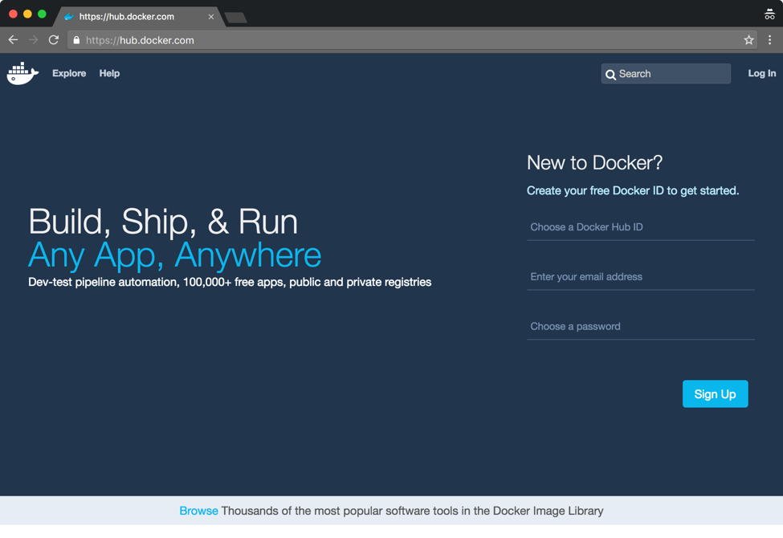
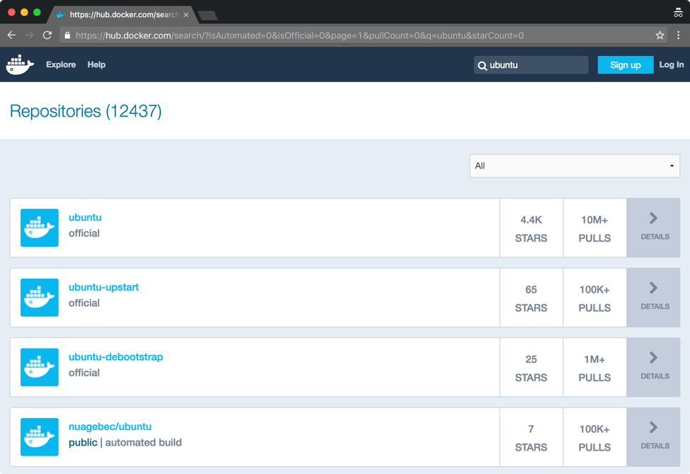
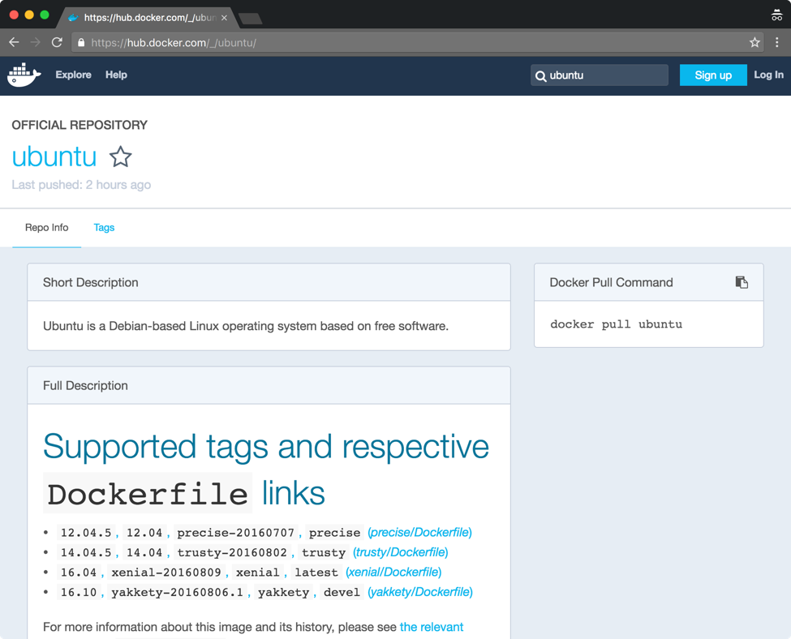

# Docker Images


## Lab 1 - Images

In this lab you will get a chance to work with and explore Docker images. Docker creates containers from images. For the
Docker Engine to launch a container, the image the container is based on must be present on the Docker host. If an image
isn't already present when a run command requires it, the Docker Engine will download the image automatically from a
registry if possible. Registries are network based services that allow you to save and retrieve Docker images. The
Docker Hub is the primary public registry.


### 1. Listing images

You can list the images present on a particular Docker host using the `image ls` subcommand. Try it:

```
user@ubuntu:~$ docker image ls

REPOSITORY          TAG                 IMAGE ID            CREATED             SIZE
nginx               1.11                6b914bbcb89e        7 days ago          182 MB
httpd               latest              f316d5949bb0        8 days ago          176 MB
ubuntu              latest              0ef2e08ed3fa        8 days ago          130 MB
ubuntu              12.04               b384dd9703db        8 days ago          104 MB
hello-world         latest              48b5124b2768        7 weeks ago         1.84 kB
busybox             latest              7968321274dc        7 weeks ago         1.11 MB
centos              latest              67591570dd29        2 months ago        192 MB

user@ubuntu:~$
```

Your output may be different but as you can see the `image ls` subcommand displays all of the tagged images on your
system. Images are uniquely identified by their image ID. Prior to Docker version 1.10 image IDs generated by the Docker
Engine were Universally Unique IDs (UUIDs). UUIDs are like random numbers which meant that two identical images, built
on separate systems, would have different UUIDs. Docker 1.10 changed the Docker engine ID format to that of a SHA hash
of the image content. This means that identical images will now have identical IDs, no matter where the image is
generated.

Images are organized into repositories. A repository is like a conceptual folder. Repositories may have a single-part
name or a multipart name. Two part names are of the form account/repositoryName or URL/repositoryName, three part names
are of the form URL/account/repositoryName. We’ll look at multi-part names more closely later.

The repositories listed in the `docker image ls` example above have a single part name, for example “ubuntu”. This
indicates that the repository is an “official” repository. Such repositories are sourced from Docker Hub and curated
directly or indirectly by Docker Inc.

You can always check Docker Hub if you would like to know who maintains an image or repository (which is not a bad idea
from a security perspective). To identify the creator of the Ubuntu image go to the Docker Hub Registry and search for
ubuntu:

`https://hub.docker.com`



Searching for “ubuntu” should give you a list of repositories with “ubuntu” in the name. Click the official “ubuntu”
exact match (it should be listed first).



The Ubuntu repository details page provides useful information about the Ubuntu repository.



Many images can share the same repository name. Individual images with the same repository name are identified by tag
names. The Ubuntu repository contains four images, each with several tags. For example the tag “12.04.5” and the tag
“12.04” reference the same image which was generated with the “precise/Dockerfile”. We will look at Dockerfiles in a
later lab, Dockerfiles are the main way Docker images are constructed in practice. You can click the
“precise/Dockerfile” link to see the source and identify the author if you are curious.


### 2. Pulling a Docker image

Imagine a scenario where you are configuring a production machine (perhaps with Puppet, Ansible, or Chef). Assume this
machine will run Docker and several containers. If you know in advance the images you require, you can download them to
the host during configuration, avoiding any download delays during operation.

For example, assume we need the Fedora Rawhide image on a system to run some Fedora based containers. You can use the
following command to pull the image from Docker Hub:

```
user@ubuntu:~$ docker image pull fedora:rawhide

rawhide: Pulling from library/fedora
6271bf1169df: Pull complete
Digest: sha256:49e62633b5aa68514732a5297b7903bf67b78ebb65355a8d29744eda62d66503
Status: Downloaded newer image for fedora:rawhide

user@ubuntu:~$
```

Images are always referred to by name when pushing them to, or pulling them from, a registry. If you do not specify a
tag name, Docker will assume the tag “latest”. If you need to reference an image other than the one tagged “latest”, you
can supply the tag following the repository name and a colon.

Images can be layered. Each layer adds files or overlays files from the layers below. This allows images to be highly
reusable. Each image, other than the base image, has precisely one parent image. Because each image is assigned an ID,
Docker knows when it already has one or more of the images required by a descendant. In the example above the system
downloaded the fedora:rawhide image (6271bf1169df). Because images and their filesystem layers are static and can never
be changed, Docker can skip downloading images or filesystem layers associated with IDs it already has. Related images
can share layers, which can save transfer bandwidth, reduce memory foot prints and simplify builds among other things.


### 3. Creating Docker images

Images can be created in several ways. The easiest way to create an image is to run a container interactively and then
install the files and configuration you require. When complete you can create an image from the container using the
`docker container commit` subcommand. If you have ever taken a snapshot of a virtual machine, the process is similar.

Imagine we need to run a web server in production, and our production infrastructure runs SUSE and Ubuntu Linux, yet our
development team builds and tests web servers on CentOS 6. We can use a container in this situation. A CentOS based web
server container can run on both SUSE and Ubuntu. To illustrate we’ll build a web server image based on CentOS 6.

Run a container from the centos:6 image, name it “websvr” and attach to a Bash shell within the container:

```
user@ubuntu:~$ docker container run -it --name "websvr" centos:6 /bin/bash

Unable to find image 'centos:6' locally
6: Pulling from library/centos
32c4f4fef1c6: Pull complete
Digest: sha256:1092df198d3da4faccc0660941b763ce5adf133b0ec71701b760d6f173c1f47b
Status: Downloaded newer image for centos:6

[root@77a77c15b3c3 /]#
```

Now install the Apache web server:

```
[root@77a77c15b3c3 /]# yum install -y httpd

...
Complete!

[root@77a77c15b3c3 /]#
```

In the real world we would probably do more configuring but for our purposes, we will call our web server complete.

In Docker, a container is an instance of an image running (or stopped). You can start and stop containers but you cannot
run a container based on another container, containers must be based on an image. Also, Docker can push and pull images
to network based registries but not containers. You can however create an image from a given container and then
run/push/pull the image.

The `container commit` subcommand creates an image from a container. Exit the CentOS container you have configured and
create an image from it using the `container commit` subcommand:

```
[root@77a77c15b3c3 /]# exit

exit

user@ubuntu:~$
```

Now commit the container, replacing the ID (`77a7`) in the command with the one from your container (hint: its ID will
be its hostname at the prompts or you can find it using `docker container ls -a`):

```
user@ubuntu:~$ docker container commit -m "C6 websvr" -a "dockerlab" 77a7 lab/websvr:v0.1

sha256:d96df23257b8a60e9f067922382c7b0e2f1878bf71739e7d83910563cb510c10

user@ubuntu:~$
```

We used the following arguments to the `docker container commit` subcommand:

- **-m**		This switch adds a Message to your image (a commit message, like `git commit -m`)
- **-a**		This switch sets the Author of the image
- **77a7**	This is the ID prefix of the container to commit (from the container prompt)
- **lab**		This is the account part of the repository string
- **websvr**	This is the repository name part of the repository string
- **v0.1**	This is the tag assigned to the image

Use the `docker image ls` command to display your new image:

```
user@ubuntu:~$ docker image ls lab/websvr

REPOSITORY          TAG                 IMAGE ID            CREATED             SIZE
lab/websvr          v0.1                d96df23257b8        30 seconds ago      311 MB

user@ubuntu:~$
```

To display all of the images your new image is based on, you can use the `image history` subcommand:

```
user@ubuntu:~$ docker image history lab/websvr:v0.1

IMAGE               CREATED              CREATED BY                                      SIZE                COMMENT
d96df23257b8        About a minute ago   /bin/bash                                       116 MB              C6 websvr
8315978ceaaa        4 months ago         /bin/sh -c #(nop)  CMD ["/bin/bash"]            0 B                 
<missing>           4 months ago         /bin/sh -c #(nop)  LABEL name=CentOS Base ...   0 B                 
<missing>           4 months ago         /bin/sh -c #(nop) ADD file:e5428f255dd7260...   195 MB              
<missing>           6 months ago         /bin/sh -c #(nop)  MAINTAINER https://gith...   0 B                 

user@ubuntu:~$
```

In the example listing, two images have IDs and three do not. The image ID d96df23257b8 is our new websvr image. The
image ID 8315978ceaaa is the centos:6 image we based our container on. The remaining images are layers of instructions
used to build the centos:6 image. Only one of these images has a filesystem layer, and therefore shows a non-zero size.
Because these ancestor images were downloaded as part of the centos:6 image they do not have independent IDs locally and
cannot be directly executed.


### 4. Running a Docker image

Run your new image with a Bash shell and explore the container created:

```
user@ubuntu:~$ docker container run -it lab/websvr:v0.1

[root@51ec878f3701 /]# ps -ef

UID         PID   PPID  C STIME TTY          TIME CMD
root          1      0  0 05:38 ?        00:00:00 /bin/bash
root         14      1  0 05:38 ?        00:00:00 ps -ef

[root@51ec878f3701 /]# yum list installed | grep httpd

httpd.x86_64                     2.2.15-56.el6.centos.3             @updates    
httpd-tools.x86_64               2.2.15-56.el6.centos.3             @updates    

[root@51ec878f3701 /]# ls /usr/sbin/httpd

/usr/sbin/httpd

[root@51ec878f3701 /]# exit

exit

user@ubuntu:~$
```

After exploring the container generated from the image exit back to the host. Try running a container from your image as
a daemon with the *-d* switch:

```
user@ubuntu:~$ docker container run -d lab/websvr:v0.1

03c65a9c32d177540cfbb570bbab277349f58ce8ca873305b8b2a80f7bc4502c

user@ubuntu:~$
```

Is it running?

```
user@ubuntu:~$ docker container ls

CONTAINER ID        IMAGE               COMMAND             CREATED             STATUS              PORTS               NAMES
```

Your column output may vary if you modified the `container ls` output in the `.docker\config.json`.

```
user@ubuntu:~$ docker container ls -a

CONTAINER ID        IMAGE               COMMAND             CREATED              STATUS                            PORTS               NAMES
03c65a9c32d1        lab/websvr:v0.1     "/bin/bash"         38 seconds ago       Exited (0) 37 seconds ago                             angry_mestorf
51ec878f3701        lab/websvr:v0.1     "/bin/bash"         About a minute ago   Exited (127) About a minute ago                       unruffled_wiles
77a77c15b3c3        centos:6            "/bin/bash"         8 minutes ago        Exited (0) 6 minutes ago                              websvr

user@ubuntu:~$
```

The container launched with the *–d* switch exited immediately after we launched it. This is because the command
associated with the image is `/bin/bash` and Bash shell exits immediately if they are not connected to an input stream.
What we really want is for the container to run the web server, `/usr/sbin/httpd`.

This image needs more work before it is ready to use.


### 5. Committing new image metadata

Using `container commit` as we did above creates an image with the same basic features (metadata) as the container we
used to create the image. The commit “--change” flag allows you to change the metadata of the new committed image. You
can use any of the following Dockerfile commands with the change switch:

- CMD – sets an overridable set of arguments for the command line
- ENTRYPOINT – sets base command line arguments that are not overridden by default
- ENV – sets an environment variable
- EXPOSE – defines network service ports
- LABEL – creates arbitrary key/value pairs
- ONBUILD – supports image templating
- USER – configures the default container user
- VOLUME – mounts an external volume
- WORKDIR – sets the working directory

We will cover Dockerfiles in detail later but for now you can think of a Dockerfile as a way to script image creation.

Try running the image you just created interactively (*-it*) without a command argument, then use `ps` to see which
program the container runs by default:

```
user@ubuntu:~$ docker container run -it lab/websvr:v0.1

[root@e1e7c5bb51f6 /]# ps -ef

UID         PID   PPID  C STIME TTY          TIME CMD
root          1      0  0 05:41 ?        00:00:00 /bin/bash
root         15      1  0 05:41 ?        00:00:00 ps -ef

[root@e1e7c5bb51f6 /]# exit

exit

user@ubuntu:~$
```

In the example above you can see that the image launches a `bash` shell when no other argument is given. Examine the
history of the image:

```
user@ubuntu:~$ docker image history lab/websvr:v0.1

IMAGE               CREATED             CREATED BY                                      SIZE                COMMENT
d96df23257b8        7 minutes ago       /bin/bash                                       116 MB              C6 websvr
8315978ceaaa        4 months ago        /bin/sh -c #(nop)  CMD ["/bin/bash"]            0 B                 
<missing>           4 months ago        /bin/sh -c #(nop)  LABEL name=CentOS Base ...   0 B                 
<missing>           4 months ago        /bin/sh -c #(nop) ADD file:e5428f255dd7260...   195 MB              
<missing>           6 months ago        /bin/sh -c #(nop)  MAINTAINER https://gith...   0 B                 

user@ubuntu:~$
```

Note that the image we created by committing the container inherited the `/bin/bash` CMD. Using `commit` with the
*--change* switch we can override this.

Imagine we want to commit the container as before but we want to run `/usr/bin/httpd` or `/bin/sh` or some other program
when the image is executed. Use the command below to recommit the container but this time with `/bin/sh` as the default
command:

```
user@ubuntu:~$ docker container commit --change 'CMD ["/bin/sh"]' e1e7 lab/websvr:latest

sha256:7221fd58a110b47eb4bb2003d413aefc77bd417983459db54c53f17564ea32fe

user@ubuntu:~$
```

Now run the new image and see which program runs by default:

```
user@ubuntu:~$ docker container run -it lab/websvr:latest

sh-4.1# ps -ef

UID         PID   PPID  C STIME TTY          TIME CMD
root          1      0  0 05:43 ?        00:00:00 /bin/sh
root          7      1  0 05:43 ?        00:00:00 ps -ef

sh-4.1# exit

exit

user@ubuntu:~$
```

If you run `docker image history` on the new lab/websvr:latest image you will see that it comes from the same
`/bin/bash` based container. However, if you look at the metadata, you will see that the image in fact uses the
configured command “/bin/sh”.

```
user@ubuntu:~$ docker image inspect -f '{{.Config.Cmd}}' lab/websvr:latest

[/bin/sh]

user@ubuntu:~$
```

Using `docker container commit` and multiple *--change* switches we can configure an image that has the correct
environment variables and configuration to run a web server.  Commit a new image from your container with the necessary
metadata to run our webserver:

```
user@ubuntu:~$ docker commit --change 'CMD ["/usr/sbin/httpd","-D","FOREGROUND"]' \
--change 'ENV APACHE_RUN_USER www-data' \
--change 'ENV APACHE_RUN_GROUP www-data' \
e1e7 lab/websvr:v0.2

sha256:c194130aac70a70f0204011d0b2bf2958f66455039075b1a50171cc22785154a

user@ubuntu:~$
```

The `container commit` subcommand above is listed on multiple lines for readability using the backslash `\` character to
escape the return key. You can type it all on one line if you like. When the commit completes the resulting web server
image can be run in the background as a daemon:

```
user@ubuntu:~$ docker container run -d lab/websvr:v0.2

ba756868c982b21ba58e2e789f35c454163ba244ef1e5a274e022f1a7d3bef12

user@ubuntu:~$
```

Now list the running containers:

```
user@ubuntu:~$ docker container ls

CONTAINER ID        IMAGE               COMMAND                  CREATED             STATUS              PORTS       NAMES
ba756868c982        lab/websvr:v0.2     "/usr/sbin/httpd -..."   18 seconds ago      Up 17 seconds                   unruffled_joliot

user@ubuntu:~$
```

Now we can try contacting the web server to see if it is actually running. First we need to discover the new container’s
IP address on the Docker network. Fortunately containers have metadata just like images. When Docker launches a new
container it assigns the container an IP address on the Docker host’s private Docker network and then saves the IP
address in the container’s metadata. The IPAddress key is stored under the NetworkSettings key in the container meta
data. Use the following command to lookup the container’s IP address:

```
user@ubuntu:~$ docker container inspect -f '{{.NetworkSettings.IPAddress}}' ba75

172.17.0.2

user@ubuntu:~$
```

Now we can try to hit the web server with curl. Curl the webserver’s IP using the standard WWW port 80 (the nested shell
finds and uses the IP address from the container's configuration manifest as we did in the preveious step):

```
user@ubuntu:~$ curl -s $(docker container inspect -f '{{.NetworkSettings.IPAddress}}' ba75) | head

<!DOCTYPE html PUBLIC "-//W3C//DTD XHTML 1.1//EN" "http://www.w3.org/TR/xhtml11/DTD/xhtml11.dtd">
	<head>
		<title>Apache HTTP Server Test Page powered by CentOS</title>
		<meta http-equiv="Content-Type" content="text/html; charset=UTF-8" />
		<style type="text/css">
			body {
				background-color: #fff;
				color: #000;
				font-size: 0.9em;
				font-family: sans-serif,helvetica;

user@ubuntu:~$
```

It works! Notice that we are now running a CentOS based Apache web server on an Ubuntu VM! You have just created your
first useful container image.


### 6. Deleting a Docker image

The `docker image rm` command deletes images from the local Docker system. Images stored in a registry can be downloaded
again if needed. Delete one of the websvr images with the following command:

```
user@ubuntu:~$ docker image rm lab/websvr:v0.1

Error response from daemon: conflict: unable to remove repository reference "lab/websvr:v0.1" (must force) - container 51ec878f3701 is using its referenced image d96df23257b8

user@ubuntu:~$
```

What happened?

Now remove all containers (stop them first if they are still running) that depend on the above image and retry the image
delete (make sure you use the image and container ids from your system):

```
user@ubuntu:~$ docker image rm lab/websvr:v0.1

Error response from daemon: conflict: unable to remove repository reference "lab/websvr:v0.1" (must force) - container e1e7c5bb51f6 is using its referenced image d96df23257b8

user@ubuntu:~$ docker container stop e1e7

e1e7

user@ubuntu:~$ docker container rm e1e7

e1e7

user@ubuntu:~$ docker image rm lab/websvr:v0.1

Error response from daemon: conflict: unable to remove repository reference "lab/websvr:v0.1" (must force) - container 03c65a9c32d1 is using its referenced image d96df23257b8

user@ubuntu:~$ docker container stop 03c6

03c6

user@ubuntu:~$ docker container rm 03c6

03c6

user@ubuntu:~$ docker container image rm lab/websvr:v0.1

Error response from daemon: conflict: unable to remove repository reference "lab/websvr:v0.1" (must force) - container 51ec878f3701 is using its referenced image d96df23257b8

user@ubuntu:~$ docker container stop 51ec

51ec

user@ubuntu:~$ docker container rm 51ec

51ec

user@ubuntu:~$ docker image rm lab/websvr:v0.1

Untagged: lab/websvr:v0.1

user@ubuntu:~$
```


### 7. Cleanup

To cleanup we need to stop any running containers and remove all of the containers on the lab VM. There is an easy way
to perform both tasks. The `docker container ls` subcommand displays containers and offers the following switches:

- **--no-trunc**	to display the full id
- **-a**		to display all (running and stopped) containers
- **-q**		to display only the container ids

Run the following command:

```
user@ubuntu:~$ docker container ls --no-trunc -q

ba756868c982b21ba58e2e789f35c454163ba244ef1e5a274e022f1a7d3bef12

user@ubuntu:~$
```

Your output will be different from the example. This command displays just the IDs of the running Docker containers. You
can try the command without the *–q* to see the full details.

We can feed the ids generated by the above command to the `container stop` subcommand to stop all running containers.
Try the following command:

```
user@ubuntu:~$ docker container stop $(docker container ls --no-trunc -q)

ba756868c982b21ba58e2e789f35c454163ba244ef1e5a274e022f1a7d3bef12

user@ubuntu:~$
```

Unix shells run strings enclosed '$(...)' in a subshell. The above command thus runs the `container ls` subcommand to
generate the ids of the running containers and then feeds this to the `container stop` subcommand as its argument list.
This is an easy way to stop all running containers on a system. The stop operation may take a moment with each
container.

We can use the same technique to remove all containers from a system. Try the following command:

```
user@ubuntu:~$ docker container rm $(docker container ls --no-trunc -aq)

ba756868c982b21ba58e2e789f35c454163ba244ef1e5a274e022f1a7d3bef12
305d31ed9d81364bad9539376499c50720ed1849e227f91dba6993fde7e3ae0a
77a77c15b3c35d7a85dce2a20fc5104ab8e30038748fec077161b50ce7defe1d

user@ubuntu:~$
```

This time we add the *–a* switch to the sub shell command to generate the IDs of all of the containers (running and
stopped) and pass that to the rm command. This removes all of the containers from our system.

Run a `docker container ls -a` subcommand to ensure everything is deleted.

<br>

Congratulations, you have completed the Docker images lab!

<br>
