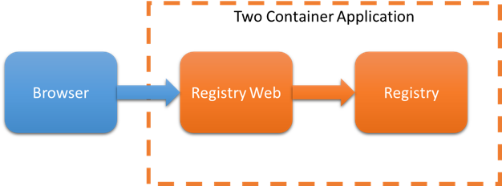
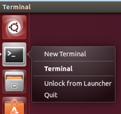
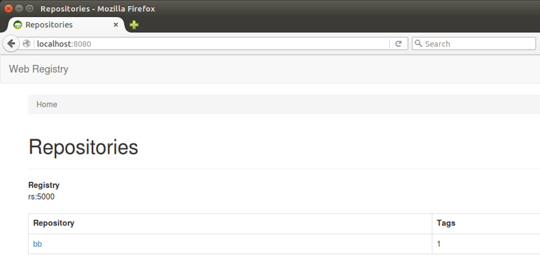
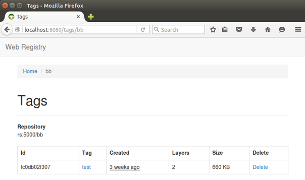
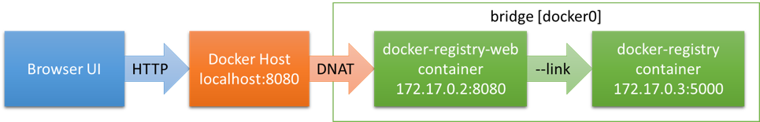
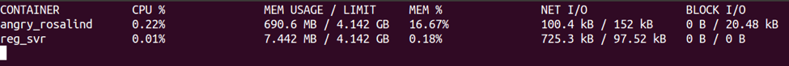

# Docker In Practice


## Lab – Networking

Docker makes it possible to deploy sets of containers as a unit. This is particularly useful in micro-service based
systems where several services work together to provide the functionality required by an application. In this lab you
will use container naming, linking and networking features to deploy an application consisting of multiple connected
containers.

The application we will deploy provides a web browser view of a private registry server. We will need two services to
support this application:

- Docker registry
- A web frontend



We will use the hyper/docker-registry-web:v0.0.4 image to supply our web front end. We will use the docker registry:2
image to provide the Docker private registry service. To connect the two containers we will give the docker registry
container a name and pass that name to the docker-registry-frontend.


### 1. Run a Named Private Registry

Before you begin, make sure that there are no running containers on your lab system. If you still have containers
running from a prior lab stop them with the `docker container stop` command and then remove them with `docker container
rm`. Use `docker help` if you need help with any of these commands.

Now run a Docker registry container with its port mapped to the host and the container name reg_svr:

```
user@ubuntu:~$ docker container run -p 5000:5000 \
--name reg_svr -d -v /home/user/images/:/var/lib/registry \
registry:2

a72a4df25fafd36ea1f132ec72bf0363b1b530598d91fc5044a64d51bab21267

user@ubuntu:~$ docker container ls

CONTAINER ID        IMAGE               COMMAND                  CREATED             STATUS              PORTS                    NAMES
a72a4df25faf        registry:2          "/entrypoint.sh /e..."   18 seconds ago      Up 17 seconds       0.0.0.0:5000->5000/tcp   reg_svr

user@ubuntu:~$
```

This is the first half of our application. Because we have named the container reg_svr we can locate this container from
other containers using the container name.


### 2. Add a Repository to the Private Registry

So that we have something to look at when we view our registry we will push a local image to the new registry. You can
pick any local image to push to the new private registry server, the example below pulls busybox:latest for the purpose.

```
user@ubuntu:~$ docker image pull busybox:latest

latest: Pulling from library/busybox
Digest: sha256:817a12c32a39bbe394944ba49de563e085f1d3c5266eb8e9723256bc4448680e
Status: Image is up to date for busybox:latest

user@ubuntu:~$ docker image ls busybox

REPOSITORY          TAG                 IMAGE ID            CREATED             SIZE
busybox             latest              7968321274dc        7 weeks ago         1.11 MB

user@ubuntu:~$
```

Create a new tag name for the image with the target registry server embedded in the repository part of the name:

```
user@ubuntu:~$ docker image tag busybox:latest localhost:5000/bb:test

user@ubuntu:~$ docker image ls | grep $(docker image ls busybox | tail -1 | awk '{print $3}')

busybox                 latest              7968321274dc        7 weeks ago         1.11 MB
localhost:5000/bb       test                7968321274dc        7 weeks ago         1.11 MB

user@ubuntu:~$
```

Now push the image to your local registry server:

```
user@ubuntu:~$ docker image push localhost:5000/bb:test

The push refers to a repository [localhost:5000/bb]
38ac8d0f5bb3: Pushed
test: digest: sha256:2efce9f5b0cb8815d192ae634b4c87943d0f0b873d98487ee98f8ed0504bd572 size: 527

user@ubuntu:~$
```

The example above pushes the BusyBox image, tagged latest, to the localhost:5000 private registry with the repo name
“bb” and the tag “test”.


### 3. Run the Web Interface

Now that we have the registry container running we can launch the web server for the registry. The web server needs to
know where to find the registry server, however, every time you start the registry server it will be assigned a new IP
address.

We can solve this problem with linking. We gave the registry server the name “reg_svr”, so we can now link the web
server to the “reg_svr” container without knowing (or caring) what its IP address is. To run the web server container
linked to the registry server container try the following:

```
user@ubuntu:~$ docker container run -d \
-p 8080:8080 \
--link reg_svr:rs \
-e REGISTRY_HOST=rs \
-e REGISTRY_PORT=5000 \
hyper/docker-registry-web:v0.0.4

Unable to find image 'hyper/docker-registry-web:v0.0.4' locally
v0.0.4: Pulling from hyper/docker-registry-web
6599cadaf950: Pull complete
23eda618d451: Pull complete
f0be3084efe9: Pull complete
52de432f084b: Pull complete
a3ed95caeb02: Pull complete
046a73d67eb5: Pull complete
49e232c91292: Pull complete
1b3d3edcb8c0: Pull complete
443c6be83b07: Pull complete
acc5e3a670ed: Pull complete
3fba224c69c5: Pull complete
899bee01d56d: Pull complete
024dfcae310d: Pull complete
9ce9e67812f6: Pull complete
16a23677f2ad: Pull complete
09fe01400d15: Pull complete
47752d0d4bed: Pull complete
abb73b84590d: Pull complete
Digest: sha256:729b25ca0e5808d11b2a843f075166acf85203970897936a1b1db8ff76ba5b39
Status: Downloaded newer image for hyper/docker-registry-web:v0.0.4
e4f3554eb9a9372dd4ca809d24b96f489f8c58e61dc0550c42b8988c6f4d3703

user@ubuntu:~$
```

The command above launches the registry web server, linking the “rs” host name in the web server container to the IP
address of the “reg_svr” container. We then use the `-e` switch to set the REGISTRY_HOST environment variable to the
hostname the web server will use to reach the registry server.


### 4. Test the Application

To test the linked container application we can use any browser that can reach our Lab VMs network interface.

- N.B. If you are using a cloud instance to complete the labs you will need to open port 8080 and browse to it over the
internet.

- N.B. If your Lab VM is running on a desktop/laptop hypervisor and you can reach the Lab VM network interface from your
desktop/laptop, you can use a browser from your desktop/laptop to view the application.

If you cannot browse to the Lab VM network interface externally you can install FireFox in the lab VM (this works fine
but takes time to install and loads up the class room network with the FireFox download). To install FireFox on the Lab
VM, right click the terminal icon in the launch pad and choose New Terminal to launch a second terminal:



Use `apt-get` to install FireFox in the new terminal:

```
user@ubuntu:~$ sudo apt-get install -y firefox
...
```

Once FireFox is installed, run the Firefox browser:

`user@ubuntu:~$ firefox &`

In the FireFox browser navigate to the web server’s mapped port: http://localhost:8080



Next click “bb” repository link to see the tagged images it contains.



This is a simple registry front end with only basic features, it does however provide a good example of container
linking, as we now have a multi-container linked application running.


### 5. Monitor the Application

We can monitor the status and health of our container services using various Docker commands.

#### Running Containers

Use the `container ls` subcommand to examine the services running in containers on your system:

```
user@ubuntu:~$ docker container ls

CONTAINER ID        IMAGE                              COMMAND                  CREATED             STATUS              PORTS                    NAMES
e4f3554eb9a9        hyper/docker-registry-web:v0.0.4   "./start.sh"             2 minutes ago       Up About a minute   0.0.0.0:8080->8080/tcp   thirsty_khorana
a72a4df25faf        registry:2                         "/entrypoint.sh /e..."   5 minutes ago       Up 5 minutes        0.0.0.0:5000->5000/tcp   reg_svr

user@ubuntu:~$
```

- Are the registry and web services up?
- If so for how long?

#### Container Logs

View the logs of the two container services, first the storage:

```
user@ubuntu:~$ docker container logs --tail 5 reg_svr

172.17.0.1 - - [08/Mar/2017:06:49:39 +0000] "PUT /v2/bb/manifests/test HTTP/1.1" 201 0 "" "docker/17.03.0-ce go/go1.7.5 git-commit/60ccb22 kernel/4.4.0-66-generic os/linux arch/amd64 UpstreamClient(Docker-Client/17.03.0-ce \\(linux\\))"
time="2017-03-08T06:51:29Z" level=info msg="response completed" go.version=go1.7.3 http.request.host="rs:5000" http.request.id=3b68bffd-db2b-43c4-89fc-4e08cca4b315 http.request.method=GET http.request.remoteaddr="172.17.0.3:39168" http.request.uri="/v2" http.request.useragent="Java/1.7.0_95" http.response.duration="237.129µs" http.response.status=301 http.response.written=39 instance.id=c9bdd4d5-491b-42dc-b880-244c7d9fc7fb version=v2.6.0
172.17.0.3 - - [08/Mar/2017:06:51:29 +0000] "GET /v2 HTTP/1.1" 301 39 "" "Java/1.7.0_95"
time="2017-03-08T06:51:29Z" level=info msg="response completed" go.version=go1.7.3 http.request.host="rs:5000" http.request.id=b8b865a3-ca3e-43ed-bb70-a9a3c2f7c133 http.request.method=GET http.request.remoteaddr="172.17.0.3:39170" http.request.uri="/v2/" http.request.useragent="Java/1.7.0_95" http.response.contenttype="application/json; charset=utf-8" http.response.duration=1.471869ms http.response.status=200 http.response.written=2 instance.id=c9bdd4d5-491b-42dc-b880-244c7d9fc7fb version=v2.6.0
172.17.0.3 - - [08/Mar/2017:06:51:29 +0000] "GET /v2/ HTTP/1.1" 200 2 "" "Java/1.7.0_95"

user@ubuntu:~$
```

Next the front end:

```
user@ubuntu:~$ docker container logs --tail 5 \
$(docker container ls -f ancestor=hyper/docker-registry-web:v0.0.4 | tail -1 | awk '{print $1}')

2017-03-08 06:51:29,313 [localhost-startStop-1] INFO  web.RestService  - Registry URL detected: http://rs:5000/v2
Mar 08, 2017 6:51:29 AM org.apache.coyote.AbstractProtocol start
INFO: Starting ProtocolHandler ["http-bio-8080"]
Mar 08, 2017 6:51:29 AM org.apache.catalina.startup.Catalina start
INFO: Server startup in 20263 ms

user@ubuntu:~$
```

As you can see in the example above the web UI is accessing the registry server using the URI http://rs:5000. When we
linked the web UI to the registry server, Docker injected the name “rs” and the IP address of the reg_svr into the web
UI container’s `/etc/hosts` file.

```
user@ubuntu:~$ docker container exec \
$(docker container ls -f ancestor=hyper/docker-registry-web:v0.0.4 | tail -1 | awk '{print $1}') \
ping -c 1 rs

PING rs (172.17.0.2) 56(84) bytes of data.
64 bytes from rs (172.17.0.2): icmp_seq=1 ttl=64 time=0.058 ms

--- rs ping statistics ---
1 packets transmitted, 1 received, 0% packet loss, time 0ms
rtt min/avg/max/mdev = 0.058/0.058/0.058/0.000 ms

user@ubuntu:~$
```

What did the previous command do?

#### Container Network Information

Inspect the IP address of the containers and the `/etc/hosts` file of the web UI container:

```
user@ubuntu:~$ docker container inspect -f '{{.NetworkSettings.IPAddress}}' reg_svr

172.17.0.2

user@ubuntu:~$ docker container inspect \
$(docker container ls -f ancestor=hyper/docker-registry-web:v0.0.4 | tail -1 | awk '{print $1}') \
-f '{{.NetworkSettings.IPAddress}}'

172.17.0.3

user@ubuntu:~$ docker container exec \
$(docker container ls -f ancestor=hyper/docker-registry-web:v0.0.4 | tail -1 | awk '{print $1}') \
cat /etc/hosts

127.0.0.1	localhost
::1	localhost ip6-localhost ip6-loopback
fe00::0	ip6-localnet
ff00::0	ip6-mcastprefix
ff02::1	ip6-allnodes
ff02::2	ip6-allrouters
172.17.0.2	rs a72a4df25faf reg_svr
172.17.0.3	e4f3554eb9a9

user@ubuntu:~$
```

When we launched the web UI container the *--link reg_svr:rs* switch added the “rs” hostname to the `/etc/hosts` file
with the IP address of the registry container. This allowed us to tell the web UI to find the registry server using the
hostname “rs”. Docker v1.10 provides DNS name resolution for containers on user defined networks.

Both the registry server and the web UI container are on the default bridge network. Display the network information for
the bridge network:

```
user@ubuntu:~$ docker network ls

NETWORK ID          NAME                DRIVER              SCOPE
e943915b1cb2        bridge              bridge              local
f077f1a35d46        host                host                local
eeaef4dce20c        none                null                local

user@ubuntu:~$ docker network inspect bridge

[
    {
        "Name": "bridge",
        "Id": "e943915b1cb25ede9671dfc0a05e35235a43f5bd922e5f0ca33ed3e422f3d924",
        "Created": "2017-03-07T20:03:36.301221431-08:00",
        "Scope": "local",
        "Driver": "bridge",
        "EnableIPv6": false,
        "IPAM": {
            "Driver": "default",
            "Options": null,
            "Config": [
                {
                    "Subnet": "172.17.0.0/16",
                    "Gateway": "172.17.0.1"
                }
            ]
        },
        "Internal": false,
        "Attachable": false,
        "Containers": {
            "a72a4df25fafd36ea1f132ec72bf0363b1b530598d91fc5044a64d51bab21267": {
                "Name": "reg_svr",
                "EndpointID": "3acf0dd8cade9f9f056d2da2f84ef95322a5f3d603e5e587a16b90a4dce98c80",
                "MacAddress": "02:42:ac:11:00:02",
                "IPv4Address": "172.17.0.2/16",
                "IPv6Address": ""
            },
            "e4f3554eb9a9372dd4ca809d24b96f489f8c58e61dc0550c42b8988c6f4d3703": {
                "Name": "thirsty_khorana",
                "EndpointID": "4a03ffcf2ff19b11007cf75199b7e8985eca66e284cc9001d9dc91f459d71357",
                "MacAddress": "02:42:ac:11:00:03",
                "IPv4Address": "172.17.0.3/16",
                "IPv6Address": ""
            }
        },
        "Options": {
            "com.docker.network.bridge.default_bridge": "true",
            "com.docker.network.bridge.enable_icc": "true",
            "com.docker.network.bridge.enable_ip_masquerade": "true",
            "com.docker.network.bridge.host_binding_ipv4": "0.0.0.0",
            "com.docker.network.bridge.name": "docker0",
            "com.docker.network.driver.mtu": "1500"
        },
        "Labels": {}
    }
]

user@ubuntu:~$
```

The application as deployed in the example looks something like this:



The *--link* switch was the only “Docker supplied” way for one container to discover another by host name prior to
Docker v1.9. Docker v1.9 introduced container networking, adding all named containers on a user defined network to the
`/etc/hosts` file of other containers. In Docker v1.10 the Docker daemon acts as a DNS server allowing the same lookups
without modifications to container `/etc/hosts` files.

We could rebuild the example above in Docker v1.9+ by creating a private network for the web UI and the registry server
to share [e.g. `docker network create regnet`]. We could then connect both containers to the new network [e.g. `docker
network connect regnet reg_svr`.] The *--link* switch is still supported in Docker v1.10+ and today acts like an alias
command making it possible to lookup container IPs using the container name or the link name.

#### Container Filesystem Changes

What if we want to see where the registry server is storing images that we push to it? Try the `container diff`
subcommand:

```
user@ubuntu:~$ docker container diff reg_svr

C /var
C /var/lib
A /var/lib/registry

user@ubuntu:~$
```

The Docker registry service added the `/var/lib/registry` directory within the container. Because this is a new
directory, it exists within the container only and files created under it will not show in the `docker container diff`.
This is the directory where docker-registry saves all of the images pushed to the server.


#### Container Runtime Information

What if we want to monitor the cpu and memory consumption of our services? Run the `container stats` subcommand in a new
shell to monitor the desired running containers (substitute your own container names).

```
user@ubuntu:~$ docker container ls --format '{{.Names}}'

thirsty_khorana
reg_svr

user@ubuntu:~$
```

```
user@ubuntu:~$ docker container stats \
$(docker container ls --format '{{.Names}}')

CONTAINER           CPU %               MEM USAGE / LIMIT       MEM %               NET I/O             BLOCK I/O           PIDS
thirsty_khorana     0.10%               606.9 MiB / 3.842 GiB   15.43%              1.85 kB / 1.99 kB   184 kB / 77.8 kB    19
reg_svr             0.00%               4.508 MiB / 3.842 GiB   0.11%               720 kB / 14.9 kB    0 B / 774 kB        7

user@ubuntu:~$
```

This command will produce a continuously updating text table with various stats from both containers specified.



Use ^C (control + c) to terminate the stats display.

Next use the `container top` subcommand to display the processes running in the registry server container:

```
user@ubuntu:~$ docker container top reg_svr

UID                 PID                 PPID                C                   STIME               TTY                 TIME                CMD
root                17366               17348               0                   22:47               ?                   00:00:00            registry serve /etc/docker/registry/config.yml

user@ubuntu:~$
```

Note that `container top` shows the host based process ID of processes running in the container’s PID namespace. Within
the container the startup process is always PID 1:

```
user@ubuntu:~$ docker container exec reg_svr ps -e

PID   USER     TIME   COMMAND
    1 root       0:00 registry serve /etc/docker/registry/config.yml
   13 root       0:00 ps -e

user@ubuntu:~$
```

<br>

Congratulations! You have completed the Docker networking lab!!    

<br>
